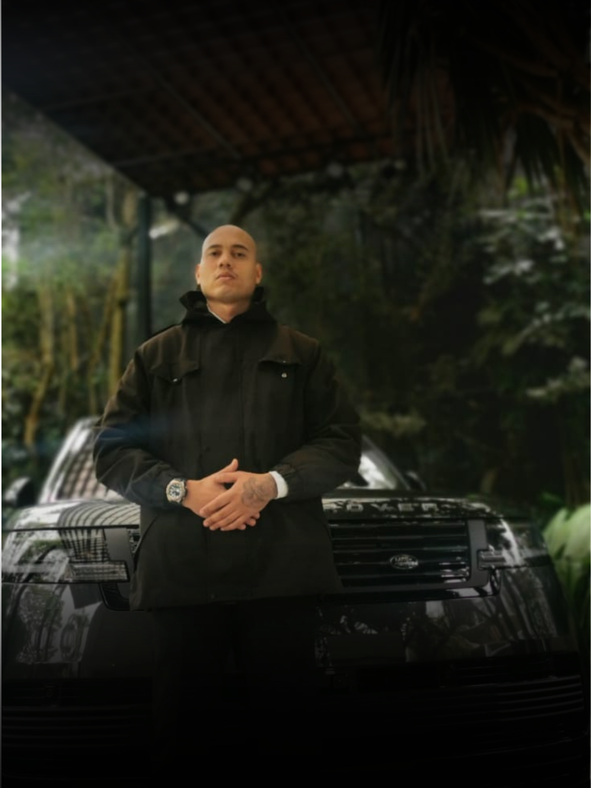
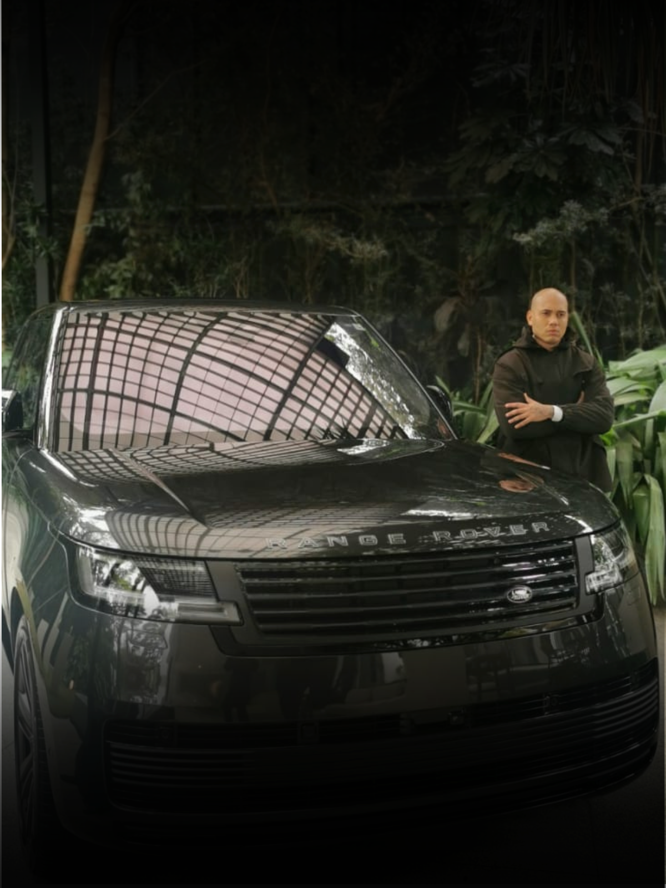

# Landing-Page
<!DOCTYPE html>
<html lang="pt-br">

<head>
    <meta charset="UTF-8">
    <meta name="viewport" content="width=device-width, initial-scale=1.0">
    <title>Página Inicial</title>
    <link rel="stylesheet" href="style.css">
    <link rel="stylesheet" href="https://stackpath.bootstrapcdn.com/bootstrap/4.1.3/css/bootstrap.min.css" integrity="sha384-MCw98/SFnGE8fJT3GXwEOngsV7Zt27NXFoaoApmYm81iuXoPkFOJwJ8ERdknLPMO" crossorigin="anonymous">
</head>

<body style="background-color: black;">
    <header class="header" style="background-color: black;">
        
Investigador Vasconcelos 

        <nav class="nav">
        </nav>
        

            <button class="btn btn-secondary" type="button" id="dropdownMenu2" data-toggle="dropdown" aria-haspopup="true" aria-expanded="false" style="background-color: #f1bd2f; color: black; border-color: black;">
                <strong>☰</strong>
            </button>
            

              <a href="servicos.html" class="dropdown-item" type="button" style="color: #000000;"><strong>Serviços</strong></a>
              <a href="sobre.html" class="dropdown-item" type="button" style="color: #000000;"><strong>Sobre</strong></a>
              <a href="contato.html" class="dropdown-item" type="button" style="color:#000000 ;"><strong>Contato</strong></a>
            

          

    </header>

    

        <ol class="carousel-indicators">
            <li data-target="#carouselExampleIndicators" data-slide-to="0" class="active"></li>
            <li data-target="#carouselExampleIndicators" data-slide-to="1"></li>
            <li data-target="#carouselExampleIndicators" data-slide-to="2"></li>
            <li data-target="#carouselExampleIndicators" data-slide-to="3"></li>
        </ol>
        

            

                
            

            

                
            

            

                         
            

            

                
            

        

        <a class="carousel-control-prev" href="#carouselExampleIndicators" role="button" data-slide="prev">
            
            Anterior
        </a>
        <a class="carousel-control-next" href="#carouselExampleIndicators" role="button" data-slide="next">
            
            Próximo
        </a>

        
    

        
        

          <h5>...</h5>
          
...

        

      

    

    <section class="hero" style="background-color: black;">
        

            <h1 style="color: #f1bd2f;">Agente de inteligência e investigação particular</h1>
            
Metódo seguro e sigiloso para extração de informações sobre empresas, instituições e pessoas.

            <a href="sobre.html" class="cta-btn" style="background-color: #f1bd2f; color: black;"><strong>Saiba Mais</strong></a>
        

    </section>

    <section class="features" style="background: radial-gradient(circle, #1d1d1d, #000000); /* Gradiente radial */
    height: 100vh;
    margin: 0;">
        

            <h2 style="color: #f1bd2f;">Qualidade</h2>
            
Oferecemos serviços de qualidade para nossos clientes.

        

        

            <h2 style="color: #f1bd2f;">Confiança</h2>
            
Nosso trabalho é baseado em confiança e transparência.

        

        

            <h2 style="color: #f1bd2f;">Suporte</h2>
            
Estamos sempre prontos para ajudar você a alcançar seus objetivos.

        

    </section>

    <section id="contato" class="contact" style="background-color: #f1bd2f;">
        <h2>Depoimentos</h2>
        <form action="#">
            <input type="text" placeholder="Seu nome" required>
            <input type="email" placeholder="Seu e-mail" required>
            <textarea placeholder="Mensagem" required></textarea>
            <button type="submit" style="background-color: black;">Enviar</button>
        </form>
    </section>

    <footer class="footer" style="background-color: black;">
        
&copy; 2025 Investigador Vasconcelos. Todos os direitos reservados.

    </footer>

    
    
    
</body>

</html>
